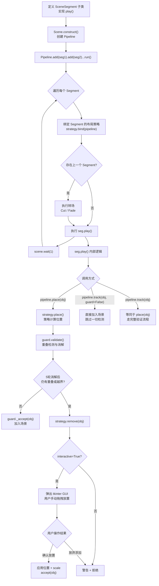

# sci-anim

基于 Manim 的科学动画框架，提供分镜编排、自动布局、交互式放置等功能。

## 项目结构

```
sci-anim/
├── framework/              # 核心框架
│   ├── __init__.py
│   ├── context.py          # SceneContext：分镜间共享状态
│   ├── guard.py            # OverlapGuard：重叠检测与消解
│   ├── interaction.py      # InteractionManager：联动动画
│   ├── layout.py           # 对齐行容器 + 重叠/越界判断
│   ├── pipeline.py         # Pipeline：场景编排器
│   ├── placement_ui.py     # 交互式放置 GUI
│   ├── segment.py          # SceneSegment：分镜基类
│   ├── strategies.py       # 布局策略（Row/Column/Free）
│   └── transitions.py      # 转场（Cut/Fade）
├── mobjects/                # 可复用的自定义 mobject
│   ├── __init__.py
│   └── text_grid.py        # TextGrid 文本网格组件
├── scenes/                  # 用户动画项目（按视频/主题组织）
│   └── workflow_demo/      # 示例：分镜编排演示
│       ├── main.py         # 入口 Scene，组装 Pipeline
│       ├── intro.py        # Segment：开场
│       ├── interaction.py  # Segment：联动交互
│       └── end.py          # Segment：收尾
└── examples/               # 框架单项能力 demo
    ├── layout_demo.py
    ├── layout_ui_demo.py
    ├── overlap_guard_demo.py
    └── text_grid_demo.py
```

## 场景组织约定

每个动画视频对应 `scenes/` 下的一个独立目录：

```
scenes/
└── my_video/
    ├── main.py       # 入口 Scene，组装 Pipeline
    ├── intro.py      # Segment: 开场
    ├── chapter1.py   # Segment: 第一章
    └── ending.py     # Segment: 结尾
```

- **一个目录 = 一个视频项目**，所有相关 Segment 放在同一目录下
- `main.py` 是唯一入口，负责将 Segment 串入 Pipeline
- 同目录下的 Segment 之间用相对 import，不同项目间零耦合
- `examples/` 只放框架单项能力的 demo，不放用户项目

## 场景构建流程



### 关键路径说明

| 路径 | 触发条件 | 结果 |
|------|----------|------|
| `place()` → `accept` | 无重叠、无越界 | 对象正常加入场景 |
| `place()` → GUI → `accept` | 有重叠/越界，且 `interactive=True`，用户在 GUI 中解决冲突 | 应用用户摆放的位置 |
| `place()` → GUI → `reject` | 有重叠/越界，用户点击"放弃添加" | 对象被丢弃，发出警告 |
| `place()` → 直接拒绝 | 有重叠/越界，且 `interactive=False` | 对象被丢弃，发出警告 |
| `track(guard=False)` | 自由布局场景自行编排位置 | 直接加入，跳过验证 |
| `track()` | 等同于 `place()` | 走完整验证流程 |

### 分镜编排

通过 `SceneSegment` 定义分镜，`Pipeline` 链式组装：

```python
from framework import Pipeline, SceneSegment
from manim import Scene

class MySegment(SceneSegment):
    def play(self):
        # 创建 mobject 并播放动画
        pass

class MyVideo(Scene):
    def construct(self):
        Pipeline(self) \
            .add(MySegment()) \
            .add(AnotherSegment()) \
            .run()
```

分镜之间通过 `SceneContext` 共享状态：

```python
class SceneA(SceneSegment):
    def play(self):
        grid = TextGrid(3, 4, texts=[...])
        self.ctx.put("grid", grid)
        self.scene.play(FadeIn(grid))

class SceneB(SceneSegment):
    def play(self):
        grid = self.ctx.get("grid")
        # 继续操作
```

通过 `InteractionManager` 联动动画：

```python
class SceneB(SceneSegment):
    def play(self):
        self.im.register("highlight", [obj_a, obj_b])
        # 后续通过 trigger 触发所有注册对象的动画
        self.im.trigger("highlight", anim_func=lambda obj: Indicate(obj))
```

### 自动布局

通过 `Pipeline.place()` 以相对位置添加对象，系统自动保证无重叠、不越界：

```python
pipeline = self.im.pipeline

# 放到画面中心
pipeline.place(a)

# 放到 a 右侧，自动加入 a 的水平行
pipeline.place(b, ref=a, direction=RIGHT)

# 放到 a 下方，自动加入 a 的垂直列
pipeline.place(c, ref=a, direction=DOWN)
```

**布局规则：**

- 水平方向放置（LEFT/RIGHT）→ 加入参考对象的水平行，行内均匀重排
- 垂直方向放置（UP/DOWN）→ 加入参考对象的垂直列，列内均匀重排
- 跨行重叠时，被侵入的行整体平移让路，最多 5 轮迭代消解
- 越界时所有对象整体居中；居中后仍越界或仍有重叠则拒绝添加

**禁用布局引擎：**

```python
Pipeline(scene, overlap_buff=None)  # 禁用，退化为手动布局
```

### 交互式放置

当自动布局失败时（空间不足），弹出 tkinter 窗口让用户手动放置：

```python
Pipeline(scene, interactive=True)   # 默认启用
Pipeline(scene, interactive=False)   # 禁用，失败时直接警告拒绝
```

**交互操作：**

| 操作 | 说明 |
|------|------|
| 点击 | 选中对象 |
| Shift+点击 | 多选/取消选中 |
| 拖拽 | 移动选中对象，多选时保持相对位置 |
| 滚轮 | 缩放选中对象（0.2x ~ 3x） |
| 绿色边框 | 所有对象位置合法，可确认 |
| 红色边框 | 存在重叠或越界，确认按钮禁用 |

**UI 方块颜色与标签：**

UI 中每个矩形代表一个 mobject，按类型统一着色和标注：

| 类型 | 颜色 | 标签 |
|------|------|------|
| Square | 深绿 `#2d7d46` | SQR |
| Rectangle | 深绿 `#2d7d46` | REC |
| Circle | 深紫 `#7d2d6e` | CIR |
| Arc | 深紫 `#7d2d6e` | Arc |
| Text | 深蓝 `#2d5a7d` | Text |
| Tex | 深蓝 `#2d5a7d` | Tex |
| MathTex | 深蓝 `#2d5a7d` | MTX |
| Paragraph | 深蓝 `#2d5a7d` | PGR |
| Line | 暗黄 `#6e6e2d` | Line |
| Arrow | 暗黄 `#6e6e2d` | ARR |
| VGroup / Group | 灰色 `#5a5a5a` | GRP |
| Dot / Cross / Star | 暗红 `#7d2d2d` | Dot / CRO / Star |
| Polygon / Triangle | 青色 `#2d7d6e` | POL / TRI |
| RegularPolygon | 青色 `#2d7d6e` | RPOL |
| ImageMobject | 棕色 `#7d6e2d` | IMG |
| 其他 | 默认灰 `#4a4a5a` | 类名缩写（大写字母） |

新放置对象：绿色虚线边框 + 白色菱形标记 + 标签 `N`。

## TextGrid 组件

可配置的文本网格，支持逐格着色、行列批量着色、文字自适应。

```python
from mobjects import TextGrid

grid = TextGrid(3, 4, cell_size=0.8, texts=[
    ["1", "2", "3", "4"],
    ["5", "6", "7", "8"],
    ["9", "10", "11", "12"],
])

# 稀疏填充
grid = TextGrid(3, 4, texts={(0, 0): "A", (2, 3): "Z"})

# 背景色
grid.set_cell_color(0, 0, RED)
grid.set_row_color(1, BLUE)
grid.set_col_color(2, GREEN)
grid.set_cells_color([(0,0), (1,1)], YELLOW)

# 文字色
grid.set_text_color(0, 0, WHITE)
grid.set_row_text_color(1, YELLOW)
grid.set_col_text_color(2, ORANGE)

# 透明度和线宽
grid.set_fill_opacity(0.5)
grid.set_cell_fill_opacity(1, 2, 0.8)
grid.set_stroke_width(3)
grid.set_cell_stroke_width(0, 0, 0.5)

# 访问子对象
cell = grid.get_cell(1, 2)
label = grid.get_label(1, 2)
```

构造参数 `fill_opacity`（默认 1.0）和 `stroke_width`（默认 1.0）控制默认透明度和线宽。
